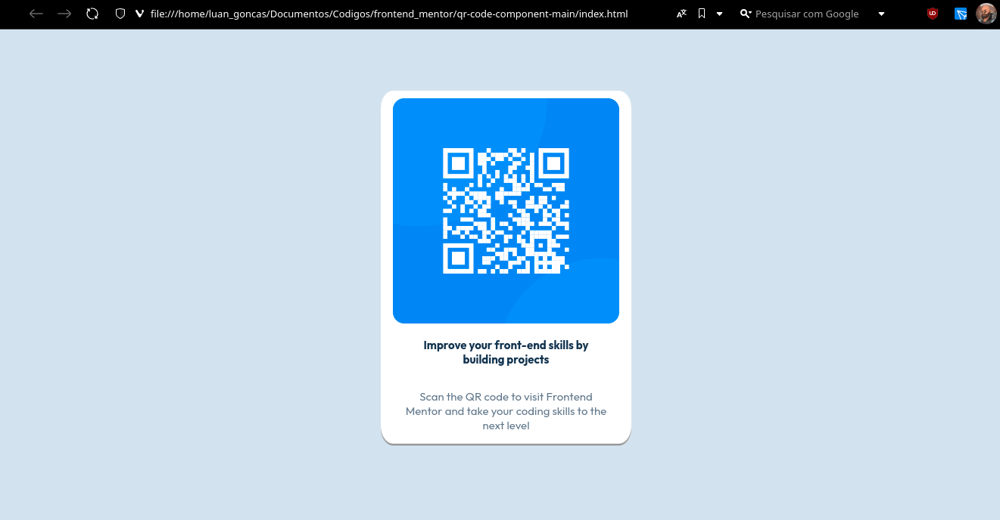
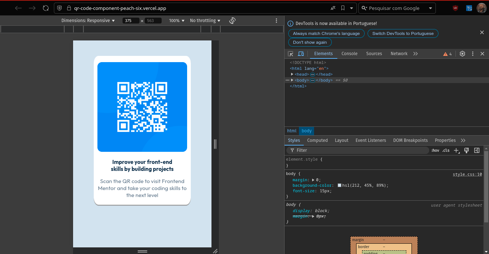

# Frontend Mentor - QR code component solution

This is a solution to the [QR code component challenge on Frontend Mentor](https://www.frontendmentor.io/challenges/qr-code-component-iux_sIO_H). Frontend Mentor challenges help you improve your coding skills by building realistic projects. 

## Table of contents

- [Overview](#overview)
  - [Screenshot](#screenshot)
  - [Links](#links)
- [My process](#my-process)
  - [Built with](#built-with)
  - [What I learned](#what-i-learned)
  - [Continued development](#continued-development)
  - [Useful resources](#useful-resources)
- [Author](#author)
- [Acknowledgments](#acknowledgments)

**Note: Delete this note and update the table of contents based on what sections you keep.**

## Overview

### Screenshot

#### Desktop screenshot


#### Mobile screenshot


### Links

- Solution URL: [Add solution URL here](https://your-solution-url.com)
- Live Site URL: [Add live site URL here](https://your-live-site-url.com)

## My process

- Setting CSS file and coloring the body background-color
- Display all elements on screen
- Put the typography properties
- Putting the elements on their respective classes
- Using viewport elements to find out correct margin and padding
- Using media queries for all default max-widths

### Built with

- Semantic HTML5 markup
- CSS custom properties
- [CSS media queries](https://developer.mozilla.org/pt-BR/docs/Web/CSS/CSS_media_queries/Using_media_queries)
- Mobile-first workflow

### What I learned

I learned to use responsiveness more effectively, rely less on Flexbox, and understand the differences in sizing across different devices.

```css
@media ((max-width: 375px) or (max-width: 425px) or (max-width: 768px)) {
    .main_card {
        max-width: 100vw;
        margin-left: 5vw;
        margin-right: 5vw;
    }

    img {
        max-width: 75vw;
        margin-left: 25vw;
        margin-right: 25vw;
    }
}
```

## Author

- Website - [Luan Santos Gonçalves](https://www.linkedin.com/in/luangoncas/)
- Frontend Mentor - [@luanGoncas](https://www.frontendmentor.io/profile/luanGoncas)
